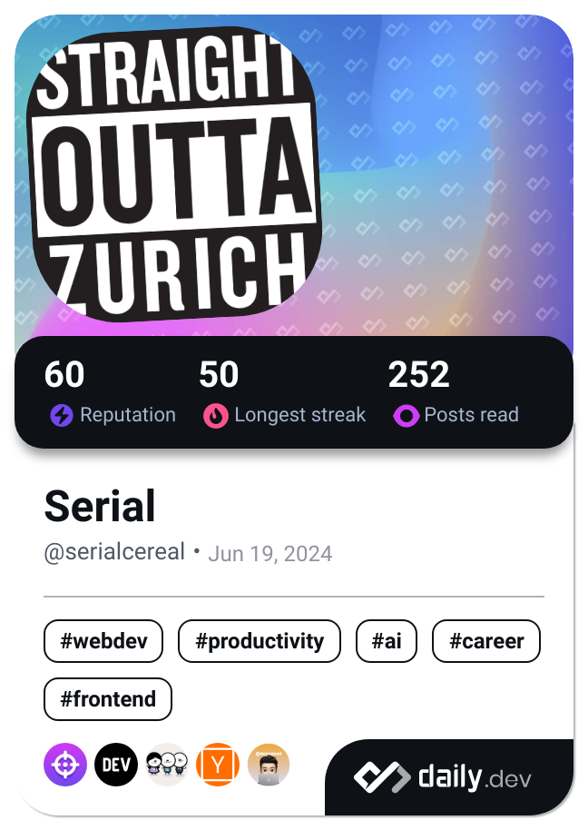

## Hi there 👋

<!--
**SerialDesign/SerialDesign** is a ✨ _special_ ✨ repository because its `README.md` (this file) appears on your GitHub profile.

Here are some ideas to get you started:

- 🔭 I’m currently working on ...
- 🌱 I’m currently learning ...
- 👯 I’m looking to collaborate on ...
- 🤔 I’m looking for help with ...
- 💬 Ask me about ...
- 📫 How to reach me: ...
- 😄 Pronouns: ...
- ⚡ Fun fact: ...
-->

<a href="https://github.com/nvbn/thefuck?utm_source=slothbytes.beehiiv.com&utm_medium=newsletter&utm_campaign=automate-your-life-with-python&_bhlid=7c27ac7ee2f0192149b6b72d25a8aa87616352d4" target="_blank">Console help needed?</a>

